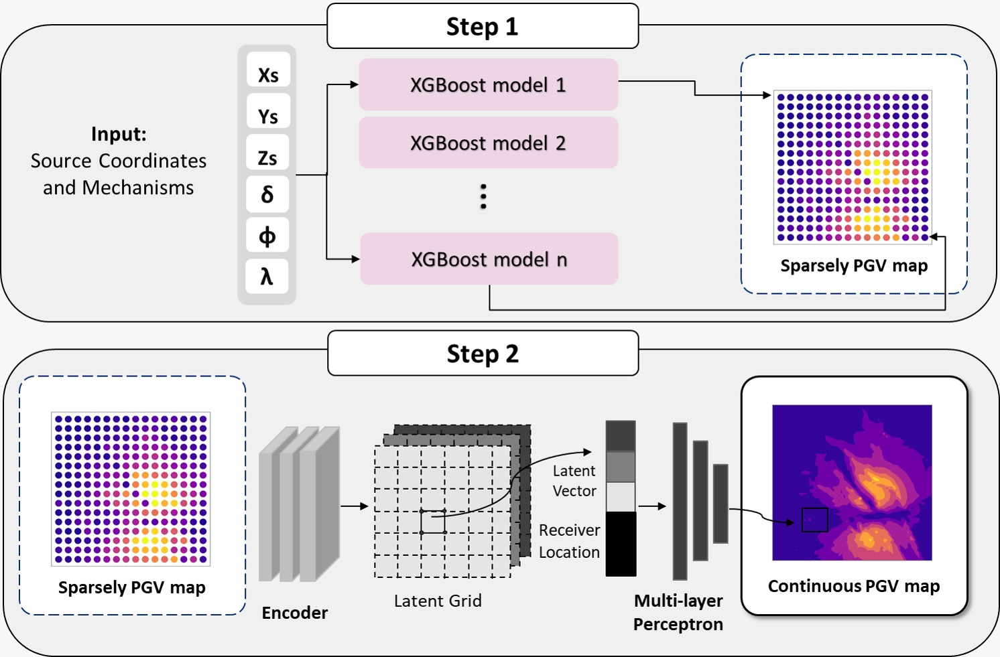

# PGVnet: Rapid, Physics-Consistent PGV Maps



<p align="left">
  <a href="https://github.com/fatimarmdnn/PGVnet/actions/workflows/ci.yml"></a>
  
  
  <a href="https://doi.org/10.5281/zenodo.xxxxx"></a>
</p>

**PGVnet** is a machine learning framework that rapidly generates *physics-consistent* peak ground velocity (PGV) maps. 
It combines **XGBoost** for sparse map generation with an **encoder-MLP** for super-resolution.

---

## Installation

```bash
# Clone the repository
git clone https://github.com/fatimarmdnn/PGVnet.git
cd PGVnet

# Create and activate a virtual environment
python -m venv .venv
source .venv/bin/activate 

# Install dependencies
pip install -r requirements.txt
```

---

## Repository Structure

```
PGVnet/
├── data/                   # Example data (forward DB, reciprocal DB, trained XGBoost models, receiver coords) 
├── src/                    # Training and evaluation source code
├── results/                # Checkpoints, predictions, plots, and metrics
└── notebooks/              # Jupyter notebooks (Framework_Pipeline.ipynb)

```

> Only example data is included. The full dataset and trained models are hosted on [Zenodo](https://doi.org/10.5281/zenodo.xxxxx).

---

## Quickstart: Running the Pipeline

You can run PGVnet either from the notebook (`Framework_Pipeline.ipynb`) or directly from the command line.

### Step 1 — Generate Sparse PGV Maps (XGBoost)

```bash
python src/xgboost_predictor.py --models_dir data/xgb_models --data_tag 50_50 --spacing_km 4
```

This will:
- Load trained XGBoost models for each receiver
- Generate sparse PGV maps to feed into the encoder-MLP (Step 2)

**Required args**:
- `--models_dir`: Path to directory with trained XGBoost models 
- `--data_tag`: e.g. `50_50 = 50 locations × 50 mechanisms` 
- `--spacing_km`: Grid spacing in km (`4`, `6`, or `8`) 
---

### Step 2 — Train the Encoder-MLP Network

```bash
python src/encoderMLP_predictor.py --mode train --data_tag 50_50_x4 --downsample_factor 4 
```

This will:
- Load and preprocess sparse map data
- Train the encoder-MLP
- Save checkpoints + learning curves to `results/`

**Required args**:
- `--mode`: `train`, `test`, or `inference` 
- `--data_tag`: e.g. `50_50_x4 = 50 locations × 50 mechanisms, downsampled ×4` 
- `--downsample_factor`: Downsampling factor (e.g. 4) 

---

### Step 3 — Evaluate the Encoder-MLP

```bash
python src/encoderMLP_predictor.py --mode test --data_tag 50_50_x4 --downsample_factor 4 --results_dir ./results/results_50_50
```

This will:
- Load the best checkpoint 
- Evaluate on unseen test data (source locations + mechanisms) 
- Save reconstructed PGV maps + performance metrics 

**Required args**
- `--mode`, `--data_tag`, `--downsample_factor` 
- `--results_dir`: Directory with trained encoder-MLP checkpoints 

---

## Outputs

All outputs are stored under `results/<run_id>/`. Key files include:

- `best_model.pth` — trained model weights 
- `test_map_sim*_comp*.png` — true vs predicted PGV maps (components East/North) 
- `test_preds.npy`, `test_gts.npy` — NumPy dumps of predictions and ground truth 
- `learning_curves.png` — training loss/metric curves 
- `test_metrics.txt` — quantitative metrics 

Example prediction:


---

## License

This project is licensed under the MIT License — see [LICENSE](LICENSE).

---

## Acknowledgements

Some components were adapted from:

- [maxjiang93/space_time_pde](https://github.com/maxjiang93/space_time_pde)

---

## Citation

If you use PGVnet in your research, please cite:

> Ramadan F. et al. (2025). *PGVnet: A Machine Learning Framework for the Generation of Rapid, Physics-Consistent PGV Maps*. Zenodo. https://doi.org/10.5281/zenodo.xxxxx