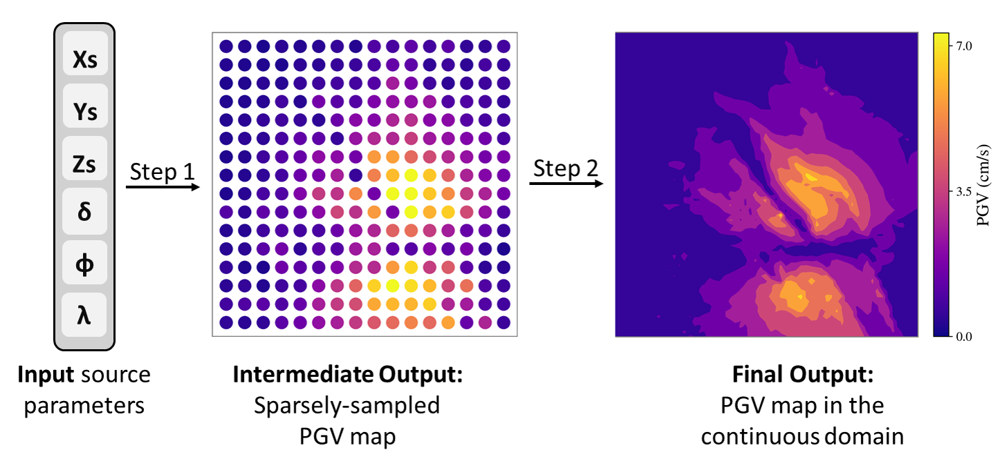

# PGVnet: Rapid, Physics-Consistent PGV Maps



This repository contains the code and models described in the manuscript:

> **PGVnet: A Machine Learning Framework for the Generation of Rapid, Physics-Consistent PGV Maps**  
> *Submitted to JGR Machine Learning (2025)*


---

##  Installation

```bash
# Clone the repository
git clone https://github.com/fatimarmdnn/PGVnet.git
cd pgvnet

# Create and activate a virtual environment, then install dependencies
python -m venv pgvenv
source pgvenv/bin/activate 
pip install -r requirements.txt
```

---

## Repository Structure

```
pgvnet/
├── data/                 # Contains forward DB, reciprocal DB, trained XGBoost models, and reciever coords
├── src/                  # Source files for training and testing
├── results/              # Checkpoints, predictions, plots, and evaluation metrics
├── Framework_Pipeline.ipynb  # Demonstrates the full pipeline (Steps 1 & 2)
```

---

##  Quickstart: Running the Pipeline

You can run the pipeline either via the notebook `Framework Pipeline.ipynb` or from the command line as shown below.

---

### Step 1: Generate Sparse PGV Maps (XGBoost)

```bash
python src/xgboost_predictor.py --models_dir /media/wolf6819/Elements/ML_data/ --data_tag 50_50 --spacing_km 4
```

This will:

- Load the trained XGBoost models for each receiver
- Generate sparse PGV predictions to be used as input for the super-resolution model in Step 2

---

### Step 2: Train the Super-Resolution Model

```bash
python encoderMLP_predictor.py --mode train --data_tag 50_50_x4 --downsample_factor 4 
```

This will:

- Load and preprocess your dataset
- Train the encoderMLP network
- Save model checkpoints and learning curves to `results/`

**Optional arguments include:**

- `--enc_type`: Choose from `edsr`, `dilated`, or `unet`
- `--fourier_features`: `True` or `False`
- `--n_samp_pts_per_patch`: Number of sample points per patch
- `--batch_size`, `--learning_rate`, etc.

---

### Step 3: Evaluate the Model

```bash
python main.py --mode test --data_tag 30_10
```

- Loads the best saved checkpoint
- Evaluates model on the test set
- Outputs reconstructed PGV fields and performance metrics

---

## Outputs

The model outputs and logs are saved under `results/<run_id>/`. Key files include:

- `best_model.pth`          : Trained model weights
- `pgv_map_sim*_comp*.png`  : Visual comparisons for an example sim and example component
- `test_preds.npy`, `test_gts.npy`: NumPy dumps of the fields
- `learning_curves.png`: Training loss/metric curves
- `test_metrics.txt`   : Quantitative evaluation metrics

---

## Acknowledgements

Some code components were adapted from the following repository:


- [maxjiang93/space_time_pde](https://github.com/maxjiang93/space_time_pde)

---

## Citation

If you use this repository in your work, please cite:

```
F. Ramadan, T. Nissen-Meyer, P. Koelemeijer, B. Fry (2025). 
PGVnet: A Machine Learning Framework for the Generation of Rapid, Physics-Consistent PGV Maps.
```